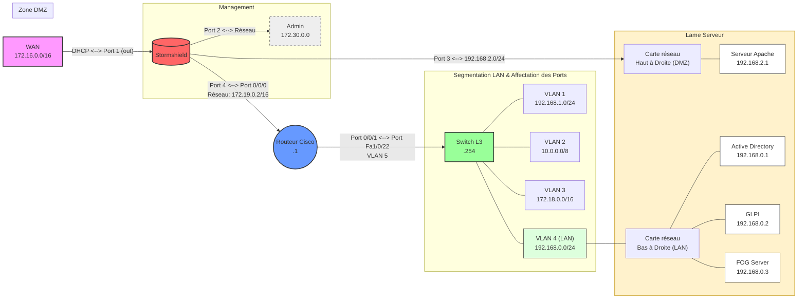

# `  🌐  ` ︲ `  🗺️  `︲Shéma Réseau - Contexte M2L

  
  
  
  

-----

## ` ❔ `︲Contexte de ce Shéma : 

Le projet s'inscrit dans le cadre des **Ateliers Professionnels (AP)** de la formation **SISR**. L'objectif est de concevoir et de déployer l'intégralité de l'infrastructure réseau de la **Maison des Ligues de Lorraine (M2L)**. Ce montage servira de support technique pour l'examen final.

L'infrastructure est segmentée en quatre zones IP distinctes :

### 1. Interconnexion et Sécurité
* **Routeur :** Assure le routage entre les zones et la route par défaut vers l'extérieur.
* **Pare-feu :** Gère le filtrage entre les interfaces et le NAT côté WAN.
* **Réseau Externe :** Liaison via le LAN du lycée en `172.16.0.0/24`.

### 2. Zone M2L "Administration"
* **Contrôleur de domaine :** Serveur Microsoft pour la gestion centralisée.
* **Services Réseau :** Serveur DHCP et DNS pour l'adressage dynamique du parc. (Dans l'AD)
* **Poste Utilisateur :** Un client de test pour valider la connectivité.

### 3. Zone DMZ (Démilitarisée)
* **Serveur Web :** Installation sous Debian avec Apache.

-----

---
